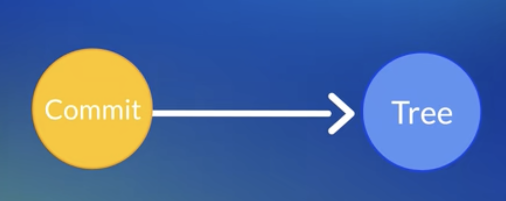
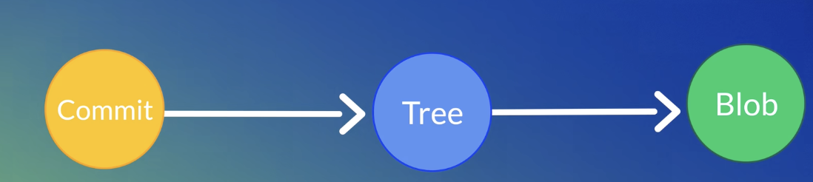
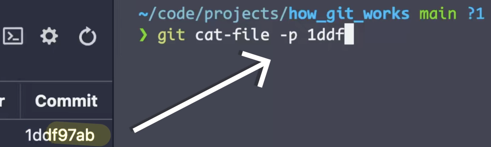
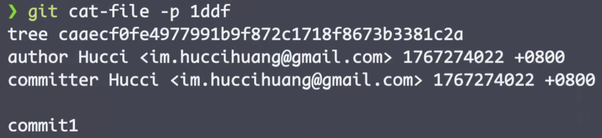
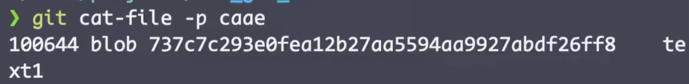
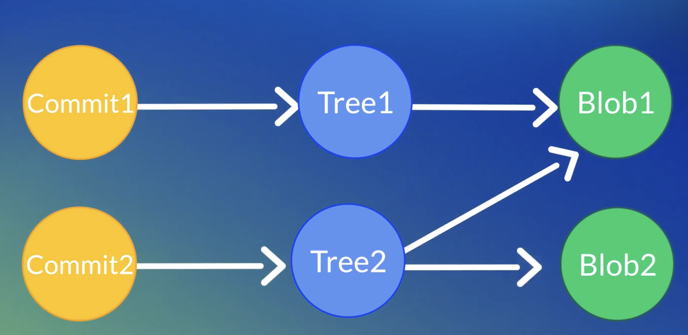
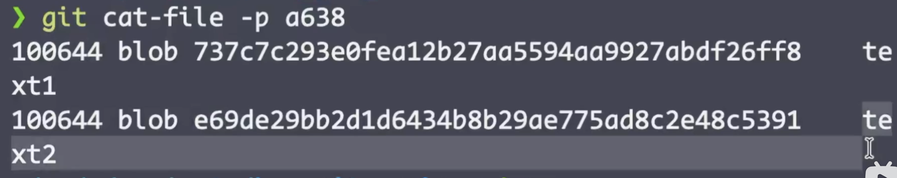
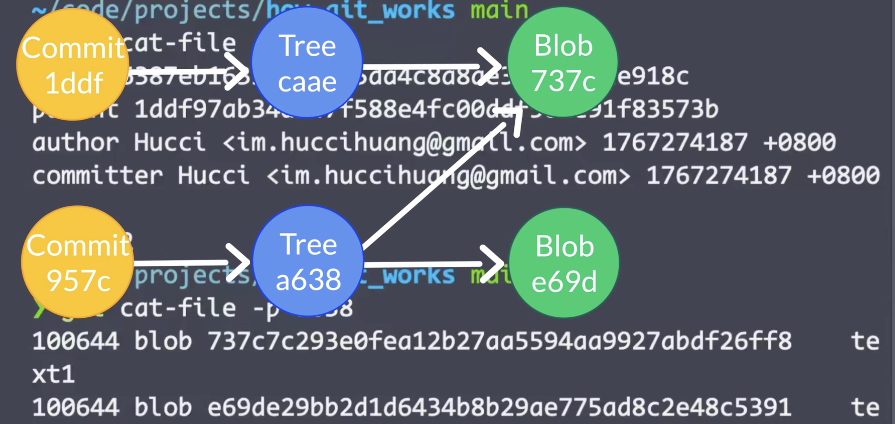
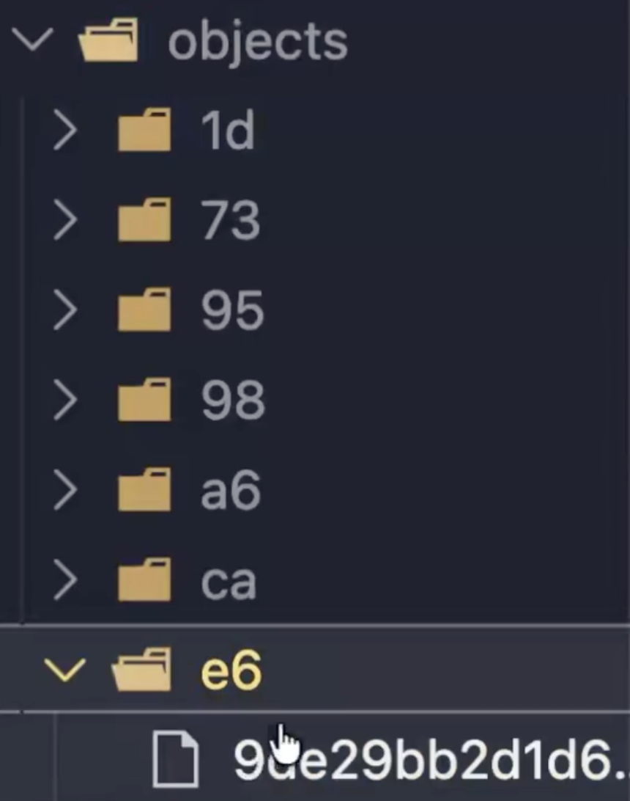
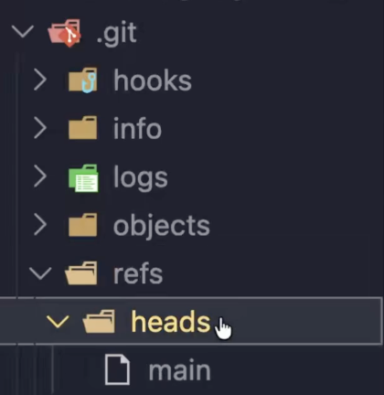

## Git 的工作原理
- 主要是依靠**commit**、**tree**、**blob**这三个对象的引用来进行操作

   * **commit**:是每次代码改动完的提交，commit会指向一个**Tree**对象
  
   * **Tree**：commit提交时的目录，tree对象会指向一个**blob**对象
   
   * **blob**：blob对象就是store 文件的具体形式
   blob对象具体都存储在.git/objects中
    ```bash
     cd .git/objects/
    ```
#### EXAMPLE
```bash
git cat-file -p <hash ID>
# hash ID:可是commit 、tree、blob的hash ID
# ID的前四位即可
```



通过以下命令可以查看blob文件中的具体内容
```bash
git cat-file -p <blob ID>
```

**于是我们发现git实际上的层层引用**


### BENEFITS

**逐级引用的好处的节省空间**

每个commit都需要记录 **完整的结构信息** ，但每个commit都将所有的files重新存储一遍，会导致大量的空间被重复占用，通过这种重复引用的方式减少对于空间的浪费。

对于未改变的file，新增的commit重复引用，新增的file再添加新的引用hash ID。
#### EXAMPLE

以上示例的 **parent** 显示出的是前一个**commit的hash ID**，表示的是当前**commit**由哪个**commit**衍生而来

**查看tree（目录dir）**

发现存在两个文件text1和text2，逻辑如下：



### ！！！ Blob对象一旦被创建就不能被修改和删除

### Q：哪如何删除一个已创建好的blob对象呢？
通过**delete** text2 (Blob e69d) 文件，再**commit**，依然可以在`.git/objects/`下找到该blob对象


#### 解决方法：
```bash
# 先删除本次commit提交
git reset 
# 所提交的blob文件成为没有引用的悬空文件
# 删除没有引用的对象
git gc --prune=now
```
- 我们所熟悉的**branch**本质上不是一个对象，而是对于某个**commit**的引用
- checkout 到某个branch，实际是跳转到了某个commit上


```bash
# branch存在.git/refs/heads下
cd .git/refs/heads
```


