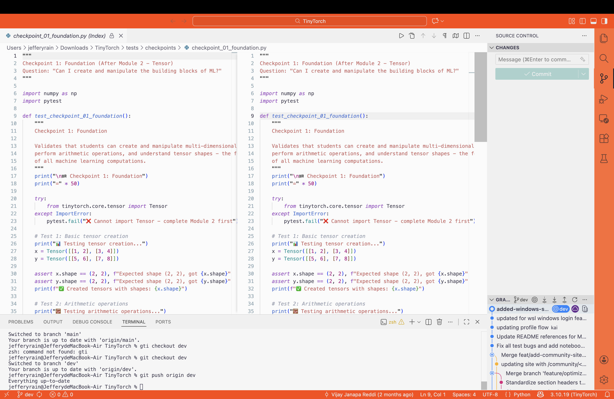

当发现vscode主题配置出现问题时

**再次确认了问题出在您工作区（Workspace）的配置上**，并且这个配置是**特定于 Git 分支**的。

当您切换到其他 $\text{Git}$ 分支时，颜色恢复正常，但一切换回那个有橙色边框的分支时，颜色又变回去了。这几乎可以肯定是因为那个**特定的分支**在其代码库中包含了修改颜色设置的文件。

-----

## 🛠️ 确认并解决问题

请重点检查您当前出现颜色问题的分支（橙色边框分支）中的以下文件：

### 1\. 检查 `.vscode/settings.json`（最常见原因）

这是最可能的原因。项目中的 $\text{Git}$ 分支可以包含一个 `.vscode` 文件夹，里面的 `settings.json` 文件会覆盖您的全局 $\text{VS}$ Code 设置。

  * **操作步骤：**
    1.  确保您处于那个有**橙色边框**的 $\text{Git}$ 分支上。
    2.  在文件资源管理器中找到并打开项目根目录下的 **`.vscode/settings.json`** 文件。
    3.  查找任何包含 **`workbench.colorCustomizations`** 的代码块。
    4.  如果找到了，**删除整个代码块**。它看起来可能像这样：
        ```json
        {
            "workbench.colorCustomizations": {
                "titleBar.activeBackground": "#ffb347",
                "activityBar.background": "#ffb347"
                // ... 其他颜色设置
            },
            // ... 其他设置
        }
        ```
    5.  **保存** `settings.json` 文件。颜色应该会立即恢复正常。

### 2\. 如果您使用的是 $\text{Peacock}$ 插件

如果你们团队有人使用 $\text{Peacock}$ 插件设置了项目颜色，它也会将设置写在 `settings.json` 中，或者有时会写在 $\text{VS}$ Code 自身的存储空间中。

  * **尝试操作：**
    1.  保持在橙色边框分支上。
    2.  打开命令面板：`Ctrl + Shift + P` (Windows/Linux) 或 `Cmd + Shift + P` (Mac)。
    3.  输入 **`Peacock`**，然后选择 **`Peacock: Reset Workspace Colors`**。

### 3\. $\text{Git}$ 提交和推送（重要）

一旦您通过修改或删除 **`.vscode/settings.json`** 文件解决了问题，**请务必执行以下步骤**：

1.  **提交更改**：将您对 `.vscode/settings.json` 的修改提交到当前的 $\text{Git}$ 分支上。
    ```bash
    git add .vscode/settings.json
    git commit -m "Fix: Remove unwanted VS Code workspace color settings"
    ```
2.  **推送更改**：将这个提交推送到远程仓库。

这样可以确保您的队友在切换到这个分支时，也不会遇到这个橙色边框的问题，并且当您自己下次切换回这个分支时，颜色也是正常的。

-----

**❓ 为什么会出现这种情况？**

这通常是因为：有人在某个时间点安装了 $\text{Peacock}$ 或手动更改了颜色，并将生成的 `.vscode/settings.json` 文件不小心**提交**到了 $\text{Git}$ 仓库中。由于 `settings.json` 是版本控制的一部分，当您切换到包含这个文件的分支时，$\text{VS}$ Code 就会加载并应用这个定制的颜色设置。